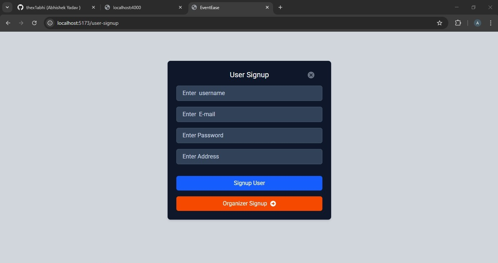
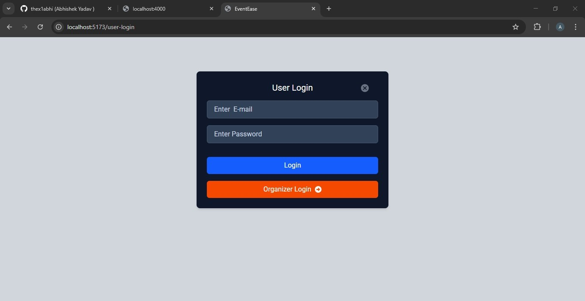
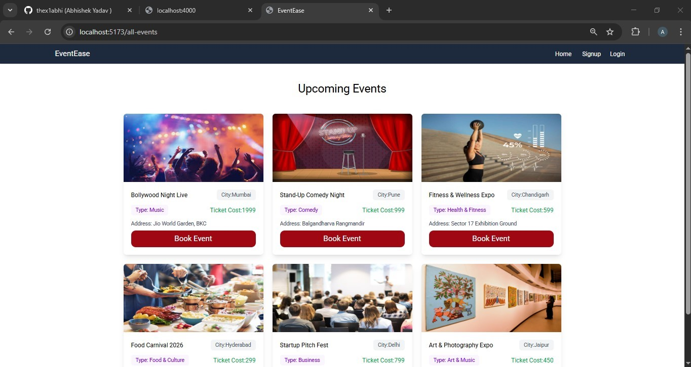
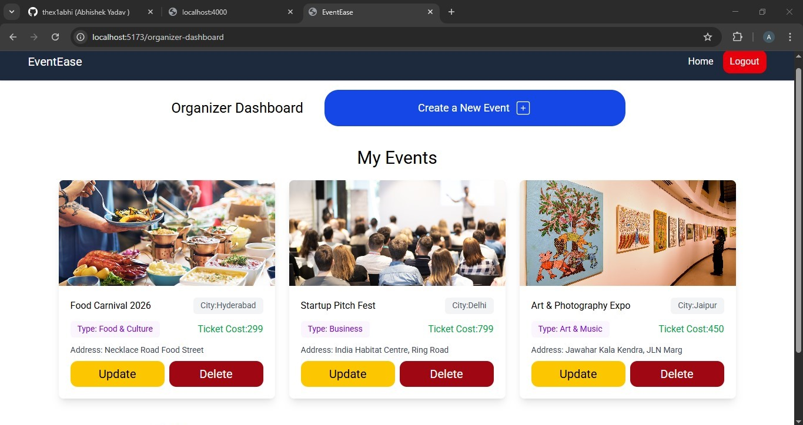
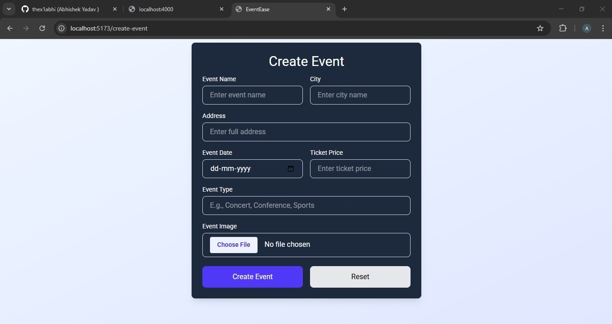
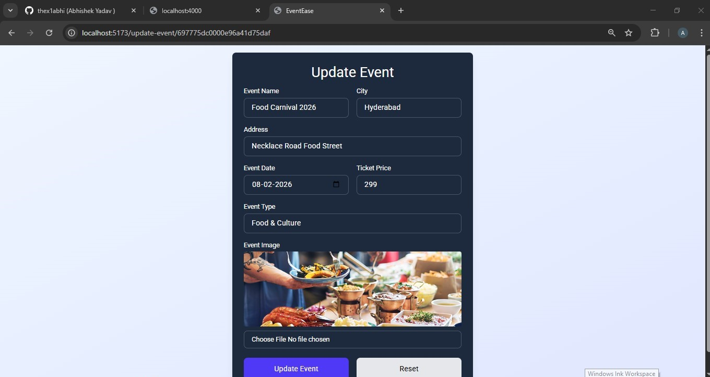

# 🎉 Event Management Application (MERN Stack)

A full‑stack Event Management Application built using the MERN stack where users can browse and book events, and organizers can create, update, and delete events. The app supports secure authentication, role‑based access, image uploads via Cloudinary, and real‑time seat booking logic.

---

## 🚀 Features

### 👤 User Features

* User authentication (JWT based)
* Browse all available events
* View event details
* Auto‑assigned seat number on booking
* View booking confirmation & seat number


### 🧑‍💼 Organizer Features

* Organizer authentication
* Create new events
* Update existing events
* Delete events
* View events created by organizer
* Upload event images using Cloudinary

### 🔐 Security & Logic

* JWT authentication & authorization
* Role‑based access (User / Organizer)

---

## 🛠️ Tech Stack

### Frontend

* React.js
* Tailwind CSS

### Backend

* Node.js
* Express.js
* MongoDB
* Mongoose


### Cloud & Tools

* Cloudinary (Image Uploads)
* MongoDB Atlas
* Postman (API Testing)

---


## ⚙️ Environment Variables

Create a `.env` file in the **backend** directory:

``` PORT="4000" 
 MONGODB_URI="" 
 
 JWT_SECRET="jwtsecretpasswod"  

 CLOUDINARY_NAME="yuorcloudinary_name"
 CLOUDINARY_API_KEY="api_key"
 CLOUDINARY_API_SECRET="api_secret"
---

 Create a `.env` file in the **frontend** directory: 

```   VITE_BACKEND_URL="http://localhost:4000/api/v1" 
  ```

## 📸 Screenshots
Home page :
  
Signup page:
  
Login page:
  
All events :
 
Event booking :
 
Organizer dashboard: 
 
Create Event page:
  
Update event page:



---


## 👨‍💻 Author

**Abhishek Yadav**
Full Stack MERN Developer

---

## ⭐ Show Your Support

If you like this project, please ⭐ the repository and share it!

---

